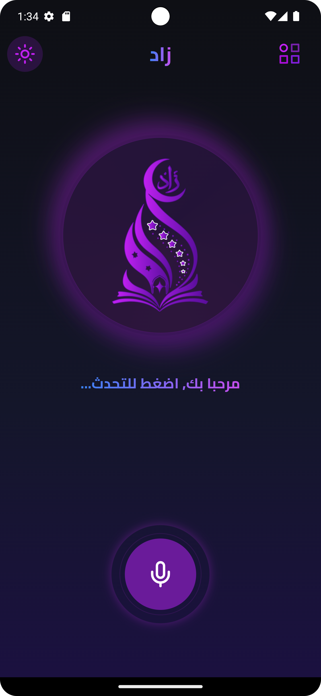
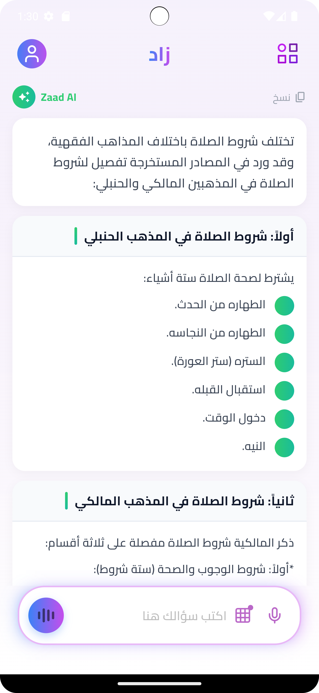
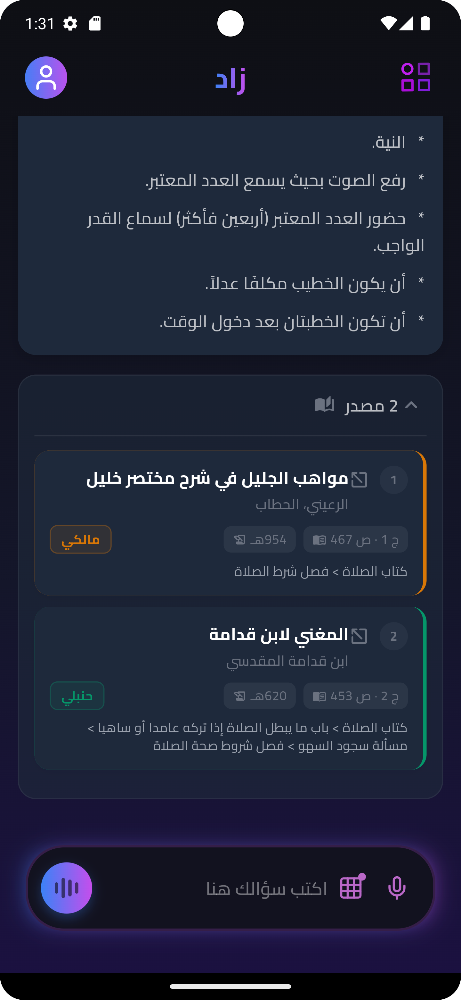
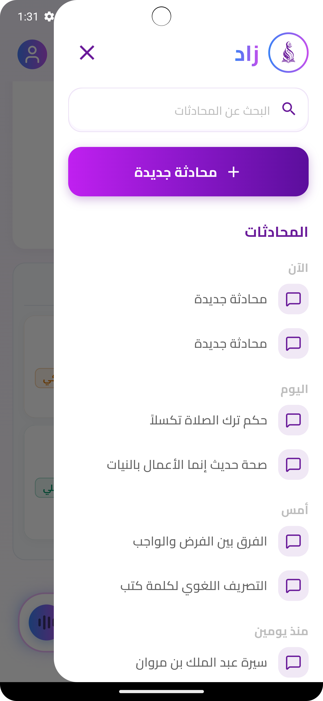

# زاد (Zaad) - المساعد الرقمي للعلوم الشرعية 🕋

**زاد** هو تطبيق مبتكر يعتمد على تقنيات الذكاء الاصطناعي لتقديم إجابات موثوقة وشاملة في مختلف مجالات العلوم الإسلامية، بما في ذلك الفقه، الشريعة، العقيدة، السيرة النبوية، وغيرها. يهدف التطبيق إلى تيسير الوصول إلى المعرفة الدينية بأسلوب عصري وتفاعلي يناسب جميع الفئات العمرية.

---

## 🌟 فكرة المشروع (Project Idea)
تطبيق "زاد" يعمل كشات بوت (Chatbot) متخصص، مصمم للإجابة على تساؤلات المستخدمين حول الأمور الدينية استناداً إلى مصادر موثوقة. يتميز التطبيق بتقديم وضعين مختلفين للاستخدام:
1.  **المستكشف الصغير (Kids Mode):** تجربة تعليمية تفاعلية مبسطة وممتعة للأطفال.
2.  **طالب العلم (Advanced Mode):** تجربة تعمقية تشمل موارد تعليمية شاملة للمتخصصين والباحثين.

---

## 📸 لقطات الشاشة (Screenshots)
<div align="center">
  
  
  
  
</div>

*(يرجى إنشاء مجلد `assets/screenshots/` في المشروع ووضع الصور داخله بالأسماء `screen1.png`, `screen2.png` الخ.. ليتم عرضها هنا)*

---

## 🚀 التقنيات المستخدمة (Technology Stack)
تم بناء التطبيق باستخدام أحدث التقنيات لضمان أداء سلس وتجربة مستخدم متميزة:
- **Flutter & Dart:** الإطار البرمجي الأساسي ولغة البرمجة المستخدمة لبناء واجهة التطبيق.
- **LiveKit Client:** لتمكين التواصل الصوتي المباشر والفعال في الوقت الفعلي داخل التطبيق.
- **Speech to Text:** لتحويل الصوت إلى نص مما يسهل على المستخدمين التحدث مع الشات بوت.
- **Bloc/Cubit & Provider:** لإدارة حالة التطبيق (State Management) بطريقة منظمة وقابلة للتوسع.
- **Dio & Retrofit:** للتعامل مع طلبات الشبكة والـ APIs بكفاءة واحترافية.
- **GetIt & Injectable:** لإدارة وحقن الاعتماديات (Dependency Injection).
- **Flutter ScreenUtil:** لضمان استجابة الواجهات (Responsiveness) على مختلف أحجام الشاشات.
- **Shared Preferences:** لحفظ بيانات المستخدم والتفضيلات محلياً.
- **Siri Wave & Flutter Animate:** لتقديم تجربة بصرية جذابة وتأثيرات حركية تفاعلية للواجهات.

---

## 🏗️ التصميم المعماري (Architecture)
يتبع المشروع نمط **Clean Architecture** مع تقسيم برمجي قائم على الميزات (**Feature-based structure**):
- **Core:** يحتوي على الأدوات المشتركة، الثيمات (Themes)، والمسارات (Routes).
- **Features:** ينقسم إلى ميزات مستقلة (مثل Auth و Chatbot) لسهولة الصيانة والتطوير المستقبلي.
  - **Presentation Layer:** يحتوي على الصفحات (Pages) والودجت (Widgets) وإدارة الحالة.
  - **Logic Separation:** فصل منطق العمل عن واجهات المستخدم لضمان قابلية الاختبار (Testability).

---


## 🛠️ تشغيل المشروع
تأكد من تثبيت Flutter SDK على جهازك، ثم قم بتنفيذ الأوامر التالية:

```bash
# تحميل المكتبات المطلوبة
flutter pub get

# تشغيل التطبيق في وضع التطوير
flutter run
```
