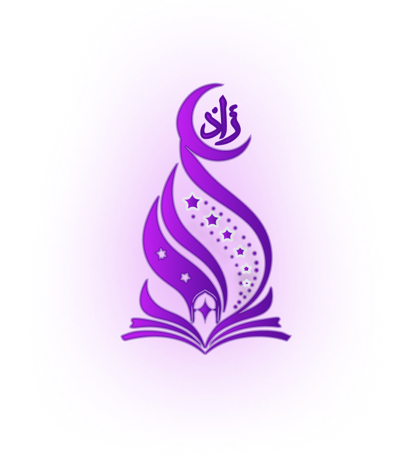
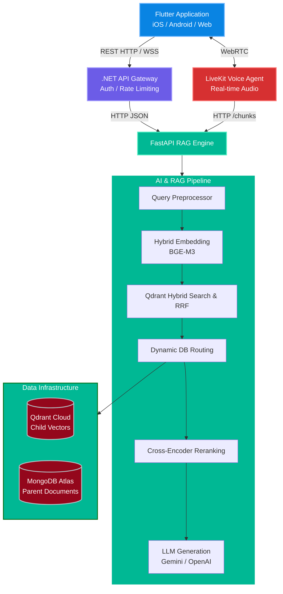
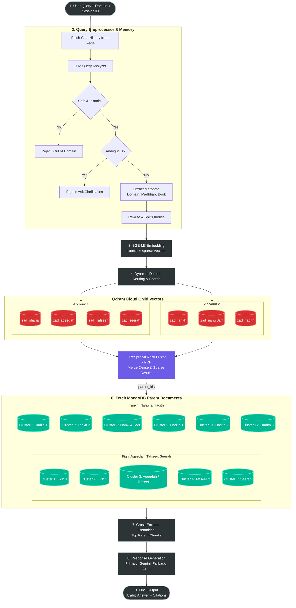
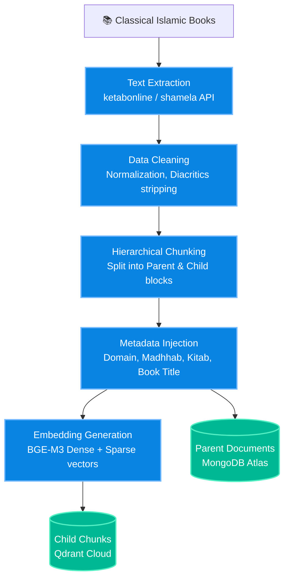

<div align="center">
  <picture>
    <source media="(prefers-color-scheme: dark)" srcset="docs/assets/WhiteLogo.png">
    <source media="(prefers-color-scheme: light)" srcset="docs/assets/DarkLogo.png">
    
  </picture>
  
  # Zad Islamic AI
  ### The Intelligent Islamic Educational Assistant
  
  [](https://opensource.org/licenses/Apache-2.0)
  [](https://www.python.org/)
  [](https://fastapi.tiangolo.com/)
  [](https://dotnet.microsoft.com/)
  [](https://flutter.dev/)
  [](https://qdrant.tech/)
  [](https://www.mongodb.com/atlas)

  **Zad** is an intelligent Islamic AI assistant powered by a production-grade **Hybrid RAG** (Retrieval-Augmented Generation) pipeline. It provides accurate, context-aware answers to questions about Islamic sciences—including Fiqh, Aqeedah, Tafseer, Seerah, Tarikh, Hadith, and Language Sciences—using trusted classical texts.
</div>

---

## 🟢 Table of Contents
- [🟢 Overview](#-overview)
- [🟢 Key Features](#-key-features)
- [🟢 System Architecture](#️-system-architecture)
- [🟢 Core RAG Pipeline](#-core-rag-pipeline)
- [🟢 Database Architecture](#️-database-architecture)
- [🟢 Tech Stack](#️-tech-stack)
- [🟢 Quick Start & Deployment](#-quick-start--deployment)
- [🟢 Data Ingestion Pipeline](#-data-ingestion-pipeline)
- [🟢 Documentation](#-documentation)
- [🟢 Contributing](#-contributing)
- [🟢 License](#-license)

---

## 🟢 Overview

**Zad-AI** is a comprehensive educational platform designed to bridge the gap between classical Islamic knowledge and modern AI technology. It delivers high-fidelity answers derived exclusively from verified, authentic Islamic sources. 

The platform offers two primary interaction modes:
1. **Text Chat (Deep Research):** A sophisticated interface for in-depth Islamic research. It leverages a Hybrid RAG pipeline—combining dense semantic search with sparse keyword matching—across a horizontally scaled database of classical texts, synthesizing precise, properly cited responses via Large Language Models (LLMs).
2. **Voice Chat (Conversational AI):** An interactive, hands-free voice assistant powered by WebRTC (LiveKit) and a custom Model Context Protocol (MCP). It allows users to converse naturally while the RAG engine retrieves and synthesizes answers in real-time.

---

## 🟢 Key Features

- ✅ **Vast Knowledge Base:** Covers 8 major Islamic domains (Fiqh, Aqeedah, Tafseer, Seerah, Tarikh, Hadith, Quranic Sciences, and Arabic Language).
- ✅ **Advanced Hybrid Search:** Combines **BGE-M3** dense semantic embeddings with sparse lexical search, fused using **Reciprocal Rank Fusion (RRF)** for maximum accuracy.
- ✅ **Parent-Child Chunking Strategy:** Optimizes vector search speed by storing small child chunks in Qdrant, while retrieving rich, full-context parent documents from MongoDB for the LLM.
- ✅ **Cross-Encoder Reranking:** Employs a cross-encoder model to rigorously rerank the retrieved contexts, ensuring only the most relevant paragraphs are sent for generation.
- ✅ **Resilient LLM Generation:** Primary response generation via **Google Gemini** with automatic API key rotation and seamless fallback to alternative providers (Groq/OpenAI).
- ✅ **Real-time Voice Agent:** Integrates LiveKit for low-latency, WebRTC-based voice interactions, enabling spoken questions and answers.
- ✅ **Cross-Platform Access:** A beautiful, responsive mobile application built with Flutter, supported by a robust .NET API gateway.

---

## 🟣 System Architecture


---

## Core RAG Pipeline

Zad-AI executes a highly sophisticated, multi-stage Retrieval-Augmented Generation (RAG) pipeline to ensure maximum accuracy and relevance when answering Islamic questions. The pipeline consists of the following steps:

1. **User Query & Preprocessing:** 
   - When a user asks a question, the **Query Preprocessor** (powered by an LLM) analyzes the input. 
   - It performs a **Safety Check** to ensure the question falls within Islamic bounds.
   - It **resolves ambiguities** and rewrites the query for optimal search performance (e.g., resolving pronouns).
   - It extracts crucial **metadata** such as the target domain and specific Madhhab (if applicable).

2. **Shared Embedding Generation:** 
   - The rewritten query is passed to the **BGE-M3** embedding model. 
   - To save compute and avoid deadlocks, the query is embedded *once* to generate both a **Dense Vector** (1024-dimensional semantic meaning) and a **Sparse Vector** (lexical/keyword representation).

3. **Hybrid Search Execution:** 
   - The pipeline routes the search to the correct **Qdrant Cloud** cluster based on the extracted domain.
   - It runs a concurrent **Hybrid Search**, launching both the Dense Retriever and Sparse Retriever in parallel.

4. **Reciprocal Rank Fusion (RRF):** 
   - The results from both the Dense and Sparse searches are mathematically merged using the **RRF algorithm**, balancing semantic understanding with exact Quranic/Hadith keyword matching.

5. **Parent-Child Context Expansion:** 
   - The vector search returns small `child_chunks` (optimized for precise matching). 
   - The pipeline extracts the `parent_id` from these chunks and dynamically routes a request to the correct **MongoDB Atlas** cluster to fetch the full, rich context (the `Parent Document`).

6. **Cross-Encoder Reranking:** 
   - The retrieved Parent Documents are scored against the user's query using a **Cross-Encoder model** (`BAAI/bge-reranker-v2-m3`). This acts as a rigorous filter, ensuring only the absolute most relevant paragraphs survive.

7. **Generation & Citation:** 
   - The top-ranked Parent Documents are injected into a domain-specific prompt.
   - The **Primary LLM (Google Gemini)** synthesizes a comprehensive Arabic answer. 
   - The LLM cites its sources in-text (e.g., `[1]`, `[2]`), and the backend maps these back to the original source URLs and book metadata for the user interface. (If Gemini fails, the system automatically falls back to Groq or OpenAI).



---

## 🟢 Database Architecture

To handle the massive scale of classical Islamic texts while keeping infrastructure costs manageable, Zad-AI shards its data across multiple free-tier cloud clusters.

<details>
<summary><b>🟣 MongoDB Atlas — Parent Chunks (Full Text)</b></summary>
<br>

| Domain (المجال) | Madhhab / Scope | Cluster Name | Database Name | Collection Name |
|:---|:---|:---|:---|:---|
| **Fiqh (الفقه)** | Hanafi & Hanbali | `zad-rag-cluster` | `zad_rag_db` | `parents_hanafi` / `hanbali` |
| **Fiqh (الفقه)** | Shafi'i & Maliki | `zad-rag-cluster2` | `zad_rag_db_shafii_maliki` | `parents_shafii` / `maliki` |
| **Aqeedah (العقيدة)** | All | `zad-rag-cluster3` | `zad_rag_db_aqeedah` | `parents_aqeedah` |
| **Tafseer (التفسير)** | Part 1 | `zad-rag-cluster3` | `zad_rag_db_tafseer` | `parents_tafseer` |
| **Tafseer (التفسير)** | Part 2 | `zad-rag-cluster4` | `zad_rag_db_tafseer` | `parents_tafseer` |
| **Seerah (السيرة)** | All | `zad-rag-cluster5` | `zad_rag_db_seerah` | `parents_seerah` |
| **Tarikh (التاريخ)** | Part 1 | `zad-rag-cluster6` | `zad_rag_db_tarikh` | `parents_tarikh` |
| **Tarikh (التاريخ)** | Part 2 | `zad-rag-cluster7` | `zad_rag_db_tarikh2` | `parents_tarikh2` |
| **Nahw & Sarf** | All | `zad-rag-cluster8` | `zad_rag_db_nahwSarf` | `parents_nahwSarf` |
| **Hadith (الحديث)** | Part 1 | `zad-rag-cluster9` | `zad_rag_db_hadith` | `parents_hadith` |
| **Hadith (الحديث)** | Part 2 | `zad-rag-cluster11`| `zad_rag_db_hadith2` | `parents_hadith2` |
| **Hadith (الحديث)** | Part 3 | `zad-rag-cluster12`| `zad_rag_db_hadith3` | `parents_hadith3` |

</details>

<details>
<summary><b>🟣 Qdrant Cloud — Vector Collections (Child Embeddings)</b></summary>
<br>

| Domain (المجال) | Qdrant Account | Client Instance | Collection Name |
|:---|:---|:---|:---|
| **Fiqh** | Account 1 | `client_1` | `zad_sharia_collection_childs` |
| **Aqeedah** | Account 1 | `client_1` | `zad_aqeedah_collection` |
| **Seerah** | Account 1 | `client_1` | `zad_seerah_collection` |
| **Tafseer** | Account 1 | `client_1` | `zad_Tafseer_collection` |
| **Hadith** | Account 2 | `client_2` | `zad_hadith_collection` |
| **Quran Science** | Account 2 | `client_2` | `zad_quranScience_collection` |
| **Tarikh** | Account 2 | `client_2` | `zad_tarikh_collection` |
| **Nahw & Sarf** | Account 2 | `client_2` | `zad_nahwSarf_collection` |

</details>

---

## 🟢 Tech Stack

- **AI Engine (RAG):** Python 3.11+, FastAPI, LangChain, Pydantic, SentenceTransformers (BGE-M3).
- **LLM Providers:** Google Gemini (Primary), Groq, OpenAI (Fallback).
- **Databases:** Qdrant Cloud (Vector), MongoDB Atlas (Document), Redis (Session Memory).
- **API Gateway:** ASP.NET Core (.NET 8.0).
- **Mobile Frontend:** Flutter (Dart).
- **Voice Agent:** LiveKit, WebRTC.
- **Infrastructure:** Docker, Docker Compose.

---

## 🟢 Quick Start & Deployment

### Prerequisites
- Docker & Docker Compose
- Python 3.11+ (for local AI engine development)
- .NET 8.0 SDK (for API Gateway)
- Flutter SDK (for Mobile App)

### 1. Clone the Repository
```bash
git clone https://github.com/your-org/zad-islamic-ai.git
cd zad-islamic-ai
```

### 2. Configure Environment Variables
You must provide the necessary API keys and database URIs.
```bash
cp services/ai_rag_engine/.env.example services/ai_rag_engine/.env
# Edit .env and fill in: QDRANT_URLs, MONGO_URIs, GOOGLE_API_KEYS, etc.
```

### 3. Deploy via Docker Compose (Recommended)
To launch the entire backend stack (AI Engine, Redis, Voice Agent):
```bash
# Development
docker-compose -f infrastructure/docker/docker-compose.yml up -d

# Production
docker-compose -f infrastructure/docker/docker-compose.prod.yml up -d
```

### 4. Run AI Engine Locally (Without Docker)
```bash
cd services/ai_rag_engine
python -m venv .venv

# Activate venv
# Windows: .venv\Scripts\activate
# Linux/Mac: source .venv/bin/activate

pip install -r ../../requirements.txt
pip install -e .

uvicorn services.ai_rag_engine.app.main:app --host 0.0.0.0 --port 8000 --reload
```
*(On Windows, you can alternatively use `.\start_api.ps1`)*

---

## 🟢 Data Ingestion Pipeline

How classical books become AI-searchable data:



---

## 🟢 Documentation

Detailed documentation is available in the `docs/` directory:
- [AI Project Structure & Codebase Analysis](./docs/ai_project_structure.md)
- [RAG Chunking Strategy](./docs/chunking_strategy.md)
- [Data Preprocessing Guide](./docs/preprocessing_guide.md)
- [Retrieval Optimization (Parent-Child & Hybrid)](./docs/retrieval_optimization.md)
- [LLM Fallback Architecture](./docs/llm_fallback_architecture.md)

---

## 🟢 Contributing

Please read our [CONTRIBUTING.md](./docs/CONTRIBUTING.md) for details on our code of conduct, and the process for submitting pull requests to us.

---

## 🟢 License

This project is licensed under the Apache 2.0 License - see the [LICENSE](LICENSE) file for details.

---
<div align="center">
  <i>Built with ❤️ for the Muslim community.</i>
</div>
