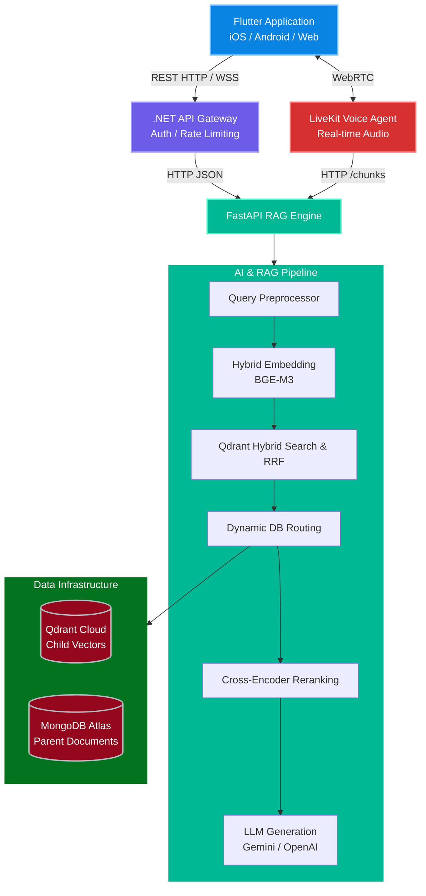

    <h2 style="color:Purple; font-weight:bold; margin-top:0;"> System Architecture</h2>
    

        Zad-AI is built upon a distributed, microservices-oriented architecture designed to handle large-scale vector search, real-time voice inference, and resilient Language Model generation. The platform operates through four primary layers: the Client Layer, the Gateway Layer, the AI Engine (RAG) Layer, and the Data Infrastructure Layer.
    

### 1. High-Level Architecture Overview

### 2. Component Breakdown

#### 2.1. Client & Gateway Layer
- **Flutter Client:** A cross-platform mobile and web application providing the user interface for text-based research and voice-based conversations.
- **.NET API Gateway:** Acts as the single entry point for standard REST requests. It is responsible for JWT authentication, request validation, and rate-limiting before routing traffic to the internal Python services.

#### 2.2. Voice & Real-Time Interaction
- **LiveKit Server:** Manages WebRTC connections for low-latency audio streaming.
- **Voice Agent Plugin:** A custom Python agent that continuously listens to the user's audio stream, transcribes it using Speech-to-Text (STT), queries the RAG engine for raw context (bypassing the text-based LLM generation to save time), and synthesizes a vocal response using Text-to-Speech (TTS).

#### 2.3. Hybrid RAG Pipeline (FastAPI)
The core of Zad-Islamic-AI is its Retrieval-Augmented Generation pipeline. It is strictly optimized for accuracy and speed:
1. **Query Preprocessor:** Analyzes the user's input, validates it against Islamic domain boundaries (Safety Guardrails), resolves ambiguities, and extracts metadata (Domain, Madhhab, Book).
2. **Dense & Sparse Embedding (BGE-M3):** Generates both semantic (dense) and lexical (sparse) vectors simultaneously to ensure highly accurate keyword matching alongside conceptual understanding.
3. **Parent-Child Retrieval:** 
   - **Qdrant:** Stores "Child" chunks (small, highly focused text segments) for rapid mathematical vector search.
   - **MongoDB:** Stores "Parent" documents (large, surrounding context). Once Qdrant identifies a match, the system fetches the full Parent document from MongoDB to provide the LLM with maximum context.
4. **Reciprocal Rank Fusion (RRF) & Reranking:** Merges dense and sparse results algorithmically, then applies a Cross-Encoder (`bge-reranker-v2-m3`) to score and filter out irrelevant contexts.
5. **LLM Generation:** The final, highly curated contexts are passed to the primary LLM (Google Gemini) alongside strict prompt instructions to generate a cited, scholarly response.

#### 2.4. Data Infrastructure
Due to the massive scale of classical Islamic texts, Zad-AI utilizes a horizontally scaled database architecture.
- **12 MongoDB Clusters:** Geographically and logically sharded based on Islamic domains (e.g., Fiqh, Aqeedah, Hadith) to circumvent free-tier storage limits and ensure high availability.
- **2 Qdrant Accounts:** Segmented to handle millions of vector points efficiently without incurring enterprise costs during the research phase.

