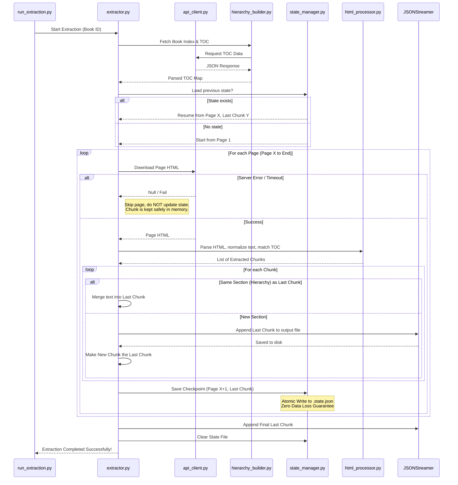
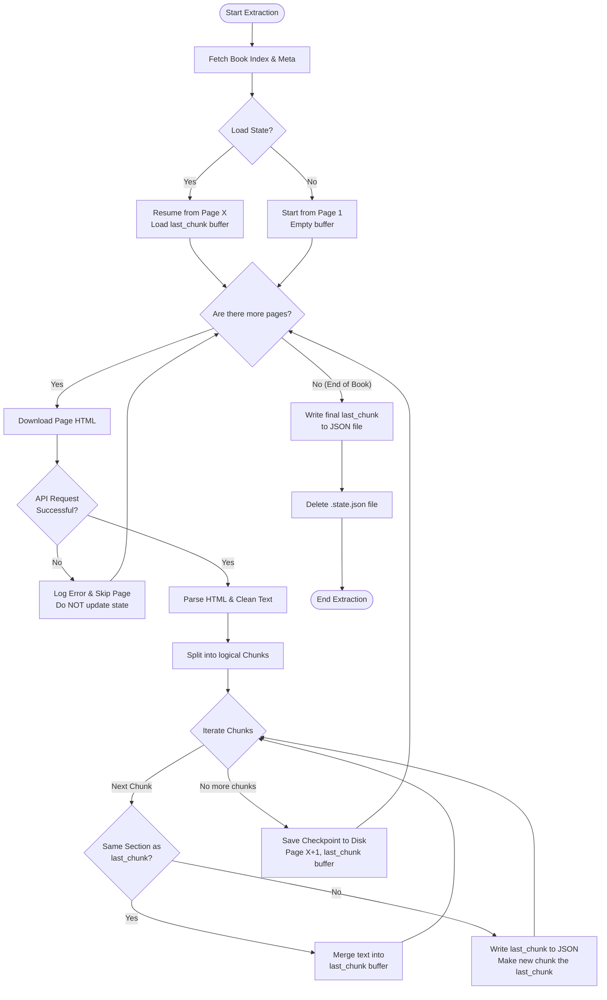

# 🔄 Data Extraction Pipeline Flow

This document outlines the architecture and execution flow of the Data Extraction Pipeline (Stage 0) for the Zad-AI project. The extraction pipeline is designed to be highly robust, resilient to server crashes, and guarantees zero data loss during the ingestion of Islamic books.

## 📁 Architecture & Components

The pipeline has been modularized into several key components located in `services/ai_rag_engine/app/pipeline/extraction/`:

1. **`api_client.py`**: The network layer. Handles all HTTP requests to the source servers with a robust retry strategy (auto-recovers from 500/502/503/504 errors).
2. **`text_utils.py`**: The helper layer. Normalizes Arabic text, builds smart Regular Expressions, and extracts metadata like death years and Hijri centuries.
3. **`hierarchy_builder.py`**: The index layer. Fetches the hierarchical Table of Contents (TOC) of the book recursively up to 3 levels deep, and maps them to their respective pages.
4. **`html_processor.py`**: The parsing layer. Uses BeautifulSoup to clean HTML, separates section titles from body paragraphs, and splits the page into logical chunks.
5. **`state_manager.py`**: The safety layer. Uses atomic writes to save the exact state of the extraction (current page and buffered chunk) to disk, ensuring 0% data loss upon unexpected termination. Includes `JSONStreamer` for safe appending to the final array.
6. **`extractor.py`**: The Orchestrator (Maestro). Ties all the components together, manages the main loop, and coordinates state saving.
7. **`run_extraction.py`**: The entry point. Where developers configure settings (Book ID, Domain, Madhhab) and initiate the process.

---

## 🗺️ Execution Flow

The following Mermaid diagram illustrates the step-by-step lifecycle of extracting a single book.

## 🛡️ Zero Data Loss Guarantee
The most critical feature of this pipeline is its resilience. During text extraction, text from multiple pages might belong to the same logical section (Hierarchy). This text is temporarily held in a memory buffer (`last_chunk`). 

If the script crashes before a new section begins, traditional scripts lose this buffer entirely. However, the `StateManager` mitigates this by aggressively writing the contents of the memory buffer alongside the current page pointer to a local file (`.state.json`) after *every single successful page extraction*. Upon restarting, the script seamlessly reloads the buffer and resumes exactly where it left off.

---

## 🌳 Logic Flowchart

Here is an alternative view using a standard Flowchart, which focuses on the logic and decision-making process during the extraction loop.

